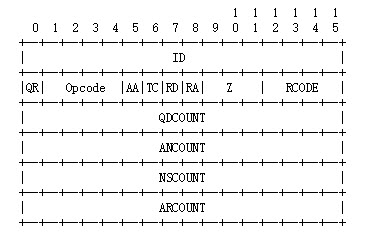
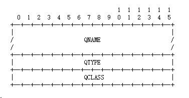
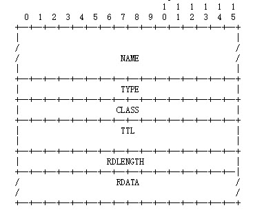

# DNS协议
## DNS协议简介
DNS(Domain Name System)域名系统是互联网的一项服务，他作为一个将域名和IP地址相互映射的一个分布式数据库，能够使人更加方便的访问互联网，DNS使用TCP和UDP端口为53.当前对于每一级域名长度限制为63个字符，域名总长度不超过253个字符。 
## DNS记录类型
常见的记录类型有: 

* 主机记录(A记录):RFC 1035定义，A记录用于名称解析的重要记录，将特定主机名映射到对应主机的IP上。
* 别名记录(CNAME记录)：RFC 1035定义，CNAME记录英语将某个别名指向到某个A记录上，这样就不需要在位某个新名字另外创建一条记录
* IPv6主机记录(AAA记录):RFC 3596定义，与A记录对应，用于将特定的主机名映射到一个主机的IPv6地址
* 服务位置记录（SRV记录）: RFC 2782定义，用于定义提供特定服务的服务器的位置，如主机（hostname），端口（port number）等
* NAPTR记录:RFC 3403定义，它提供了正则表达式方式去映射一个域名。NAPTR记录非常著名的一个应用是用于ENUM查询。

## 软件
* BIND（Berkeley Internet Name Domain），使用最广的DNS 
* DJBDNS（Dan J Bernstein's DNS implementation） 
* MaraDNS 
* Name Server Daemon（Name Server Daemon） 
* PowerDNS 
* Dnsmasq 

## DNS解析过程:
DNS查询有两种方式:递归和轮询。DNS客户端设置使用的DNS服务器一般都是递归服务器，他负责全权处理客户端的DBS查询请求，直到返回最终结果。而DNS服务器之间一般采用迭代查询方式。 
>以查询zh.wikipedia.org为例： 
*客户端发送查询报文"query zh.wikipedia.org"至DNS服务器，DNS服务器首先检查自身缓存，如果存在记录则直接返回结果。 
*如果记录老化或不存在，则
DNS服务器向根域名服务器发送查询报文"query zh.wikipedia.org"，根域名服务器返回.org域的权威域名服务器地址，这一级首先会返回的是顶级域名的权威域名服务器。 
*DNS服务器向.org域的权威域名服务器发送查询报文"query zh.wikipedia.org"，得到.wikipedia.org域的权威域名服务器地址。 
*DNS服务器向.wikipedia.org域的权威域名服务器发送查询报文"query zh.wikipedia.org"，得到主机zh的A记录，存入自身缓存并返回给客户端。 

##WHOIS(域名数据库查询)
一个域名的所有者可以通过查询WHOIS数据库[3]而被找到；对于大多数根域名服务器，基本的WHOIS由ICANN维护，而WHOIS的细节则由控制那个域的域注册机构维护。
对于240多个国家代码顶级域名（ccTLDs），通常由该域名权威注册机构负责维护WHOIS。例如中国互联网络信息中心（China Internet Network Information Center）负责.CN域名的WHOIS维护，香港互联网注册管理有限公司（Hong Kong Internet Registration Corporation Limited）负责.HK域名的WHOIS维护，台湾网络信息中心（Taiwan Network Information Center）负责.TW域名的WHOIS维护。
## DNS协议格式
### DNS查询协议格式

 

* Question: 定义了到域名服务器的查询，包含QTYPE,QCLASS,QNAME,
* Answer,Athority，Additional可能为空，
* Answer:包含了DNS服务器查询返回的资源记录。
* Authority：包含了权威域名服务的响应资源记录
* Additional：包含了和查询相关的资源记录，但是不一定是Query定义的查询的结果。

#### DNS查询中的Header格式

 

>* ID:16bit长度，用来标识此次查询用来和响应进行匹配。
* QR:1bit，代表这个包是响应包还是查询包
* OPCODE:4bit，代表这次查询的类型
	* 0:标准查询
	* 1:反向查询
	* 2:服务器状态请求
	* 3-15:作为未来用
* AA:1bit 用在响应包中，如果为1则表明本次的回答是权威DNS服务器的回答。
* TC:1bit 用来表明本次包因为长度太长被切断了。
* RD:1bit 这个位设置在查询包中，并复制到响应包中，如果为1，则直接到DNS服务器进行递归查询。
* RA:1bit 用在响应包中，表明服务器是否在支持递归查询。
* Z:4bit  必须为0，留作未来使用。
* RCODE:4bit 响应码:作为响应的一部分.
* QDCOUNT:16bit 表明查询的个数
* ANCOUNT:16bit 表明响应的资源记录个数
* NSCOUNT:16bit 表明Authority区域的资源记录个数即权威响应的资源记录个数
* ARCOUNT:16bit 表明Additional域的资源记录个数
####  Question部分格式

 

* QNAME:域名
* QTYPE:查询类型
* QCLASS: 查询所属类别
#### Answer部分格式
Answer,Authority,Additional三部分格式相同如下如所示: 
 

* NAME:域名eg:baidu.com
* TYPE:资源记录(RR)类型，值得是RDATA类型
* CLASS:RR类别
* TTL:存活时间(单位：秒)
* RDLENGTH:记录RDATA的长度
* 具体具体分析可参考2
## 参考
1.https://zh.wikipedia.org/wiki/域名系统 
2.https://tools.ietf.org/html/rfc1035 
